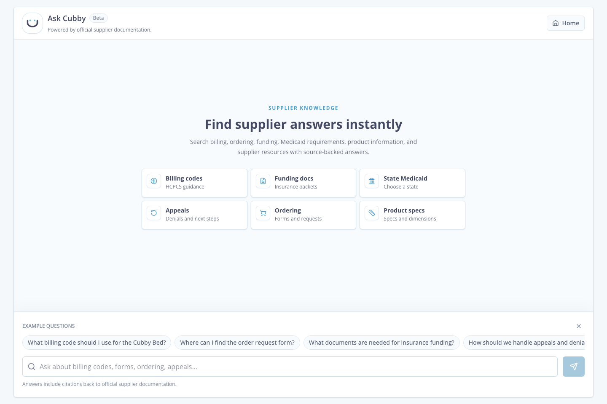

# Cubby Knowledge Assistant

## Overview

This project prototypes an AI-powered knowledge assistant for the Cubby Supplier Portal. Rather than requiring DME partners to navigate through multiple static pages, the assistant enables natural language search across supplier documentation and returns source-backed answers with citations to the underlying Cubby material. The goal is to reduce friction during onboarding and common partner workflows while keeping responses grounded and verifiable.

## Demo



## Technology Stack

- Frontend: Next.js 16, React 19, TypeScript, Tailwind CSS 4, and React Markdown. Chosen for rapid UI iteration, component reuse, and source-backed answer formatting.
- Backend/API: Next.js Route Handlers. Handles retrieval, question-risk classification, answer generation, streaming responses, and API key protection on the server.
- AI: OpenAI with `gpt-4.1-mini` by default. Chosen as a cost-conscious model with enough reasoning ability for grounded answer synthesis.
- Data: Generated local JSON knowledge base for the MVP, with custom deterministic retrieval and citation mapping. This keeps the prototype inspectable while preserving a path toward semantic indexing later.

## Why This Problem?

When navigating the portal as a DME, the biggest friction point was not that Cubby lacks information. It was that the information is spread across many pages, cards, forms, FAQs, and linked help-center articles. A DME partner may need to answer a simple question about billing codes, funding documents, appeals, product setup, or ordering, but still has to know where Cubby placed that resource. This makes information retrieval a high-leverage first problem to solve, and it creates the retrieval foundation needed for future workflow automation.

## Why I Chose This MVP

While my initial instinct was to automate Letter of Medical Necessity generation, I intentionally chose to start with information retrieval. Document generation improves one portion of the partner journey, while faster knowledge retrieval improves onboarding, insurance submissions, caregiver questions, and order placement. It also establishes the retrieval foundation needed for future AI-assisted document generation and submission validation.

## Architecture

| Stage | Responsibility |
| --- | --- |
| Knowledge Ingestion | Fetches public Cubby supplier pages, discovers linked help articles, decodes article bodies, and stores section-heading chunks in a generated JSON knowledge base. |
| Retrieval & Evidence | Retrieves relevant Cubby sections, maps them to trusted citations, and gates weak evidence before answer generation. |
| Answer Generation | Uses OpenAI to synthesize concise answers only from retrieved Cubby evidence, with deterministic safe responses for high-risk question types. |
| UI | Provides the Ask Cubby chat experience with suggested topics, streaming answers, markdown rendering, and compact citation cards. |

If the retrieval gate cannot find enough relevant evidence, the assistant returns a safe refusal with no citations instead of asking the LLM to guess.

The prototype uses a generated JSON knowledge base instead of a database because the current corpus is small, public, and read-only. The scraper pulls public supplier portal pages, discovers linked Cubby help-center articles, decodes embedded article bodies, and chunks content by page section heading. This keeps the data layer easy to inspect while preserving a production-shaped ingestion and retrieval flow.

## Why Not Just Improve Keyword Search?

Traditional search requires users to know the terminology used throughout the portal. A DME partner may ask, "What billing code should I use?" while the relevant source is titled "Billing Codes & Reimbursement (HCPCS)." Natural language retrieval lets users search by intent rather than exact wording, reducing the effort required to locate the correct information.

## AI Guardrails

Implemented:

- The assistant retrieves Cubby source sections before calling the LLM.
- A lightweight deterministic question-risk classifier runs before retrieval and generation. It currently categorizes questions as `GENERAL_INFORMATION`, `HIGH_RISK_COVERAGE`, `PATIENT_SPECIFIC_ELIGIBILITY`, or `MEDICAL_OR_CLINICAL_ADVICE`.
- The LLM is instructed to answer only from supplied Cubby evidence.
- Citation cards are always derived from trusted retrieved Cubby source material rather than model-generated URLs.
- In the non-streaming flow, the model selects which retrieved sources best support its answer.
- In the streaming prototype, citation cards are derived directly from the highest-confidence retrieved sources to preserve grounding while responses stream incrementally.
- If sufficient evidence cannot be retrieved, the assistant refuses to answer and returns no citations.
- Patient-specific coverage or approval questions bypass LLM generation. The assistant may point to general documented requirements, but it does not determine whether an individual case will be approved and directs the user to confirm with the payer or Cubby.
- The assistant does not infer coverage decisions, payer rules, pricing, billing instructions, medical claims, or clinical advice beyond documented sources.
- If the LLM service is unavailable, the app fails safely by surfacing relevant Cubby resources instead of fabricating an answer.

For this prototype, the classifier is intentionally deterministic and lightweight so the behavior is easy to inspect and test. A production version should use a more robust policy and classification layer backed by evaluation data, review workflows, and human review for high-risk topics.

Out of scope:

- Patient-specific recommendations
- Insurance eligibility decisions
- Medical advice
- Final coding, billing, or legal determinations

## PHI Handling

This prototype intentionally does not collect or store PHI.

The goal of this MVP is to validate whether natural language information retrieval reduces friction for DME partners. Patient-specific information is not required for onboarding, locating documentation, or answering supplier questions, so introducing PHI would increase implementation complexity without improving the primary workflow being evaluated.

Future iterations involving document generation or insurance submissions would require authenticated user sessions, role-based authorization, encrypted storage, audit logging, and clear retention policies before handling PHI-like data.

## Deliberately Not Built

These features were intentionally deferred to keep the prototype focused on validating the highest-risk product assumption: that natural language retrieval improves partner efficiency.

- Authentication
- PHI workflows
- Patient workspaces
- Role-based user experiences (DME, caregiver, clinician)
- Conversation history
- LMN generation
- Insurance QA
- Analytics dashboards

## Future Roadmap

Phase 1: Knowledge Assistant (Current MVP)

- Natural language questions over Cubby supplier documentation
- Grounded LLM responses with citations
- Safe refusal when evidence is weak
- Improve partner onboarding and information retrieval

Phase 2: Authenticated Partner Workspace

- Authenticated DME accounts
- Personalized onboarding based on partner stage
- Patient workspaces for managing multiple cases
- Role-based access for DME, clinician, and caregiver experiences
- Workflow tracking and notifications between stakeholders

Phase 3: Intelligent Case Management

- Generate LMNs from structured patient and insurance data
- Draft supporting documentation
- Surface missing information before submission
- Track submission status across stakeholders

Phase 4: Insurance QA and Submission Intelligence

- Validate documents against payer- and state-specific requirements
- Detect missing documentation
- Surface denial risks before submission
- Learn from historical submission outcomes

## AI Usage

AI was used to accelerate development, brainstorm implementation approaches, and review architecture decisions. Final product decisions, application structure, retrieval strategy, prompt design, data handling, and engineering tradeoffs were reviewed and modified based on my own judgment.

## Setup

Install dependencies:

```bash
npm install
```

Create local environment variables:

```bash
cp .env.example .env.local
```

Add your OpenAI API key to `.env.local`:

```text
OPENAI_API_KEY=your_key_here
OPENAI_MODEL=gpt-4.1-mini
```

Run the development server:

```bash
npm run dev
```

Open:

```text
http://localhost:3000
```

## Data Ingestion

Regenerate the local knowledge base:

```bash
npm run scrape
```

The scraper:

- Fetches public Cubby supplier portal pages
- Discovers linked `help.cubbybeds.com` article URLs
- Crawls supplier-relevant help-center category pages surfaced from the portal
- Removes tracking query params from discovered help links
- Excludes non-support/giveaway content
- Decodes embedded help article bodies
- Chunks content by section heading
- Writes `data/portal-content.json`

## Validation

Run tests:

```bash
npm test
```

Run lint:

```bash
npm run lint
```

The test suite focuses on the behavior I would be most nervous shipping:

- Retrieval quality: known supplier questions retrieve the intended Cubby source sections, including state-specific Medicaid accordion content.
- Guardrails: weak or blank questions do not call the LLM and do not return misleading citations.
- Risk classification: patient-specific approval questions are caught before generation and do not produce approval or eligibility claims.
- Citation mapping: citations preserve source IDs, source URLs, section headings, ordering, and short excerpts from trusted retrieved evidence, including role-specific Medicaid sections that live on the same state page.

## Future Improvements

- Semantic embeddings for better intent matching
- Conversation memory within a session
- Partner feedback on answer usefulness
- Usage analytics for unanswered questions
- Personalized onboarding by partner state or workflow stage
- Authenticated patient workspaces
- LMN generation
- Insurance QA and submission review
